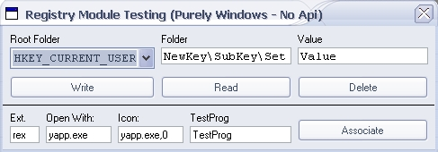



## PURE WINDOWS REGISTRY MODULE

### Description

This is a Registry class that you can put into your app. It could 'write','read',or 'delete' Any value in the reg and has a built in File Association Command. Uses no api, Pure windows! Check It Out!  Please Give Some Feedback
 
### More Info
 

             |
---                |---
**Submitted On**   |2003-01-22 00:26:22
**By**             |[Leo Barsukov](https://github.com/Planet-Source-Code/PSCIndex/blob/master/ByAuthor/leo-barsukov.md)
**Level**          |Advanced
**User Rating**    |4.5 (18 globes from 4 users)
**Compatibility**  |VB 6\.0
**Category**       |[Registry](https://github.com/Planet-Source-Code/PSCIndex/blob/master/ByCategory/registry__1-36.md)
**World**          |[Visual Basic](https://github.com/Planet-Source-Code/PSCIndex/blob/master/ByWorld/visual-basic.md)
**Archive File**   |[PURE\_WINDO1532991222003\.zip](https://github.com/Planet-Source-Code/leo-barsukov-pure-windows-registry-module__1-42635/archive/master.zip)

